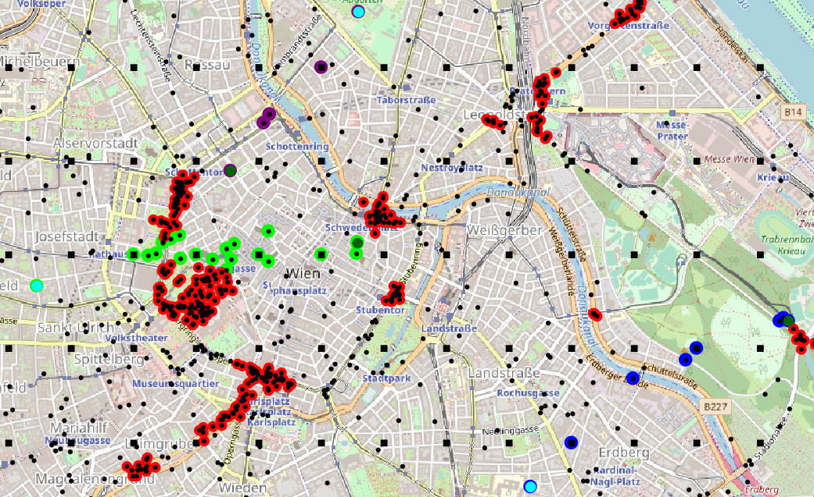

# Experiment-2021-Acsos-VirtualNodes

## Experimental results

This repository contains code and instruction to reproduce the experiments presented in the paper "Augmented Collective Digital Twins for Self-Organising Cyber-Physical Systems" by Roberto Casadei, Andrea Placuzzi, Mirko Viroli, and Danny Weyns; submitted to Acsos2021.

## Requirements

In order to run the experiments, the Java Development Kit 11 is required.
We use a version of the [Alchemist](https://github.com/AlchemistSimulator/Alchemist) simulator compatible with the JDK 11 and JDK 15, so also the JDK 15 should be fine.

In order to produce the charts, Python 3 is required.
We recommend Python 3.8.1,
but it is very likely that any Python 3 version,
and in particular any later version will serve the purpose just as well.
The recommended way to obtain it is via [pyenv](https://github.com/pyenv/pyenv).

The experiments have been designed and tested under Linux.
Everything should run on any recent Linux, MacOS X, and Windows setup.

## Running the simulations

The whole simulation batch can be executed by issuing `./gradlew caseStudyTd1000`.
**Be aware that it may take a very long time**, from several hours to days, depending on your hardware.
With the actual configuration it executes 22 simulations (11 random seed, 2 simulations for each seed).
A small batch with only one seed be executed by issuing `./gradlew caseStudyTd1000seed0`.
In this way are executed only two simulations.

A graphical execution of the simulation can be started with the following command
`./gradlew GUIwithVirtual` (for a run with virtual nodes), or `./gradlew GUIwithoutVirtual` (for a run without virtual nodes).
When the simulator is opened click the button <kbd>p</kbd> to start the simulation, see [Alchemist user guide](https://alchemistsimulator.github.io/latest/wiki/prepare/default-gui/)
for the complete list of the simulator shortcuts.
Windows users can use the `gradlew.bat` script as a replacement for `gradlew`.

Color map:

| Color | Meaning |
|-|-|
| Black dot | Physical node |
| Black square | Virtual node |
| Cyan dot | Source node |
| Dark green dot | Destination node |
| Red aura | Node in warning zone |
| Light green aura | Source 1 channel |
| Blue aura | Source 2 channel |
| Purple aura | Source 3 channel |

The following is a screenshot taken from the simulation with virtual nodes after 130 seconds of simulations,
where we can see the warning zones and the channels from each source to the respective destination.



## Generating the charts

In order to speed up the process for those interested in observing and manipulating the existing data,
we provide simulation-generated data directly in the [repository release](https://github.com/aPlacuzzi/Experiment-acsos-2021/releases/latest).
Generating the charts is matter of executing the `process.py` script.
The environment is designed to be used in conjunction with pyenv.

### Python environment configuration

The following guide will start from the assumption that pyenv is installed on your system.
First, install Python by issuing

``pyenv install --skip-existing 3.8.1``

Now, configure the project to be interpreted with exactly that version:

``pyenv local 3.8.1``

Update the `pip` package manager and install the required dependencies.

```bash
pip install --upgrade pip
pip install -r requirements.txt
```

### Data processing and chart creation

This section assumes you correctly completed the required configuration described in the previous section.
In order for the script to execute, you only need to launch the actual process by issuing `python process.py`